# Week2 实验报告（第六组）
## 1. 实验任务
见 Week2任务要求.pdf

## 2. Linux 基础命令
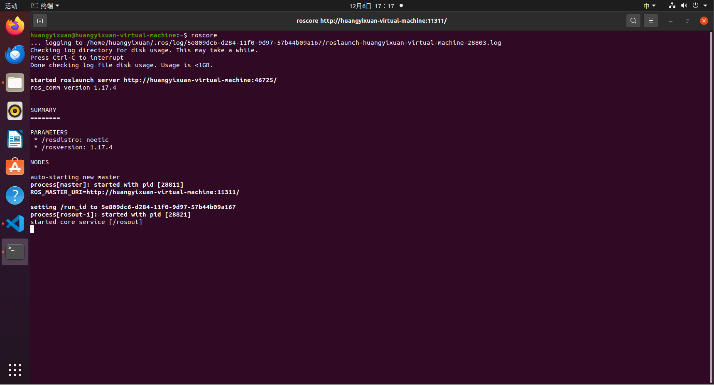
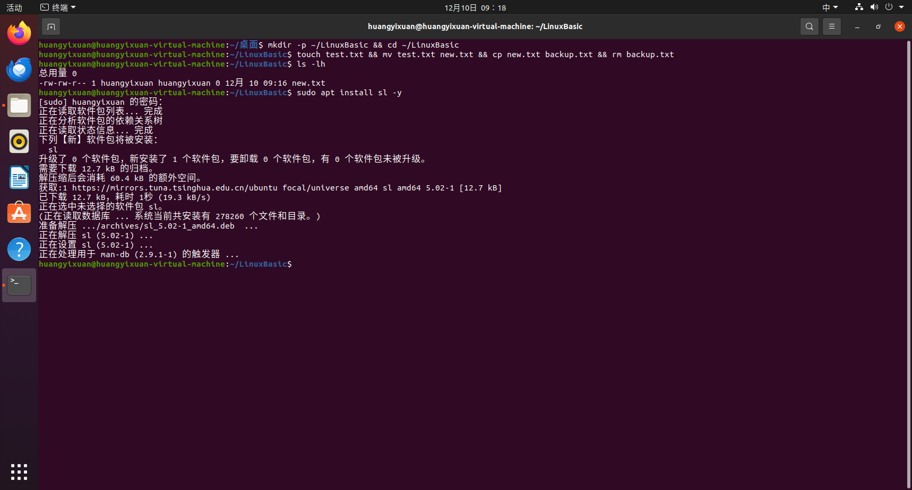
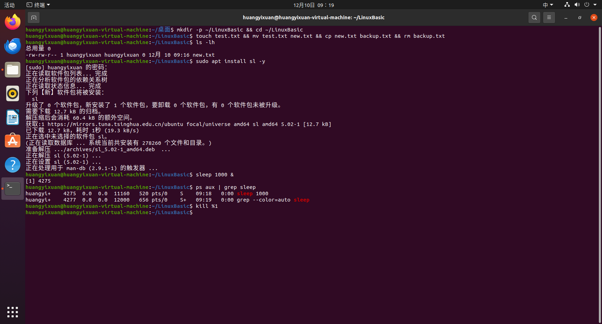

## 3. Python & C++ HelloWorld
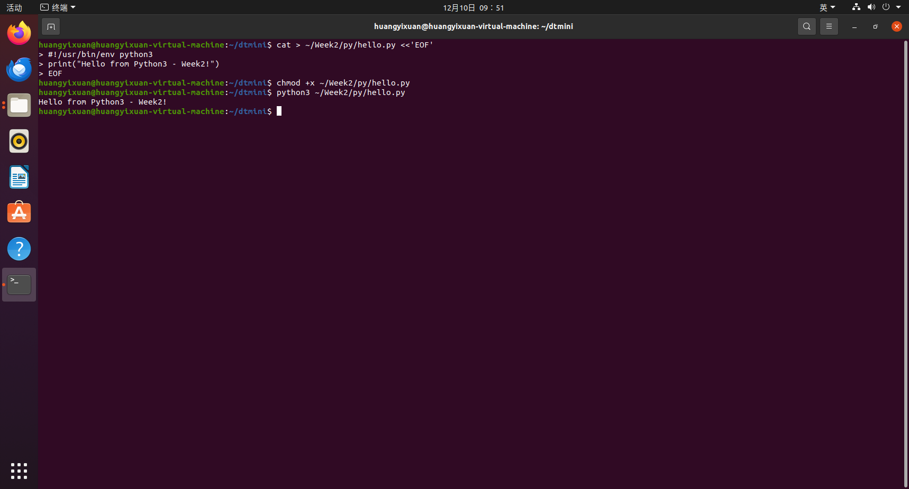
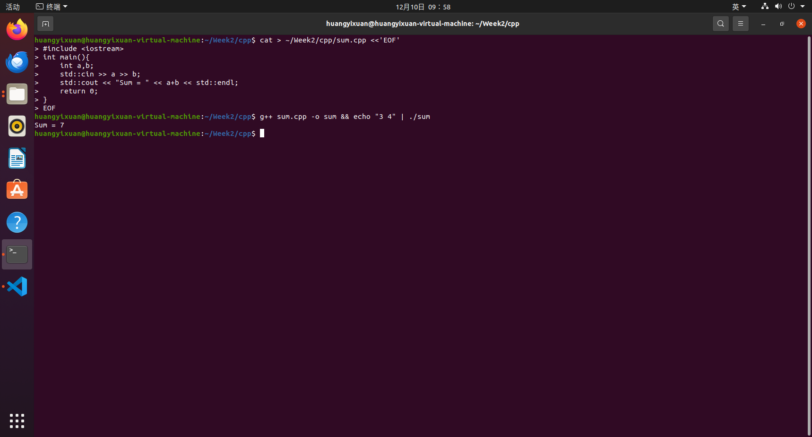

## 4. ROS1 安装验证
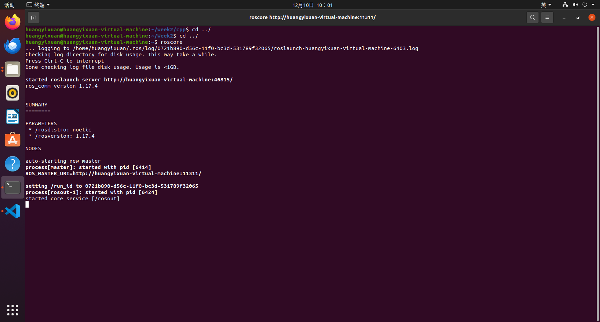
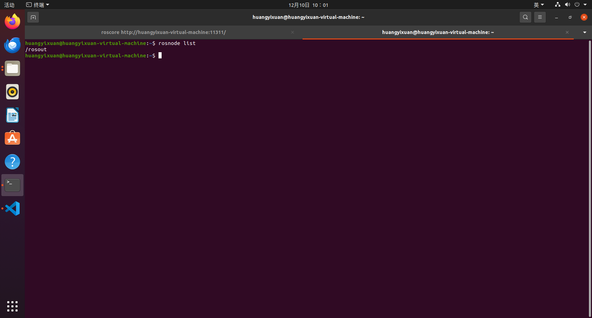
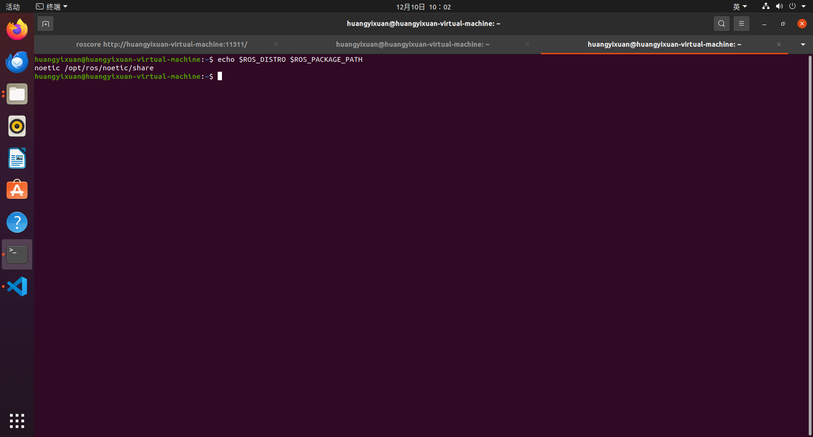

## 5. catkin_ws + Hello 节点
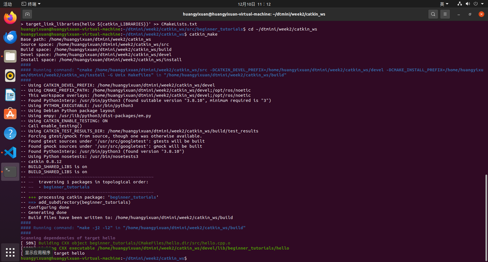
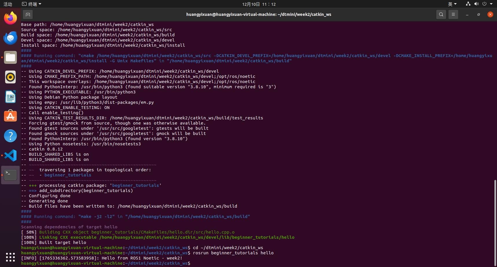

## 6. turtlesim 控制
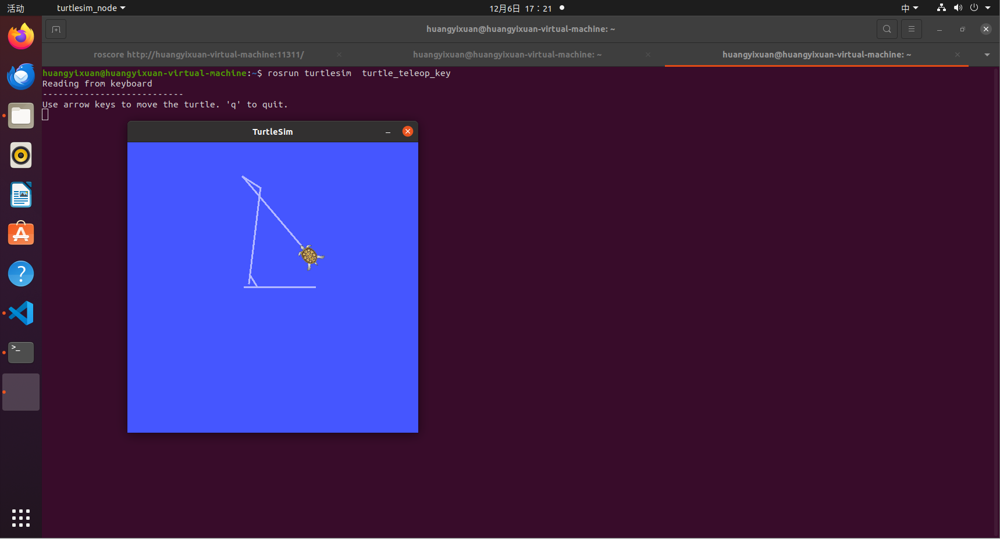
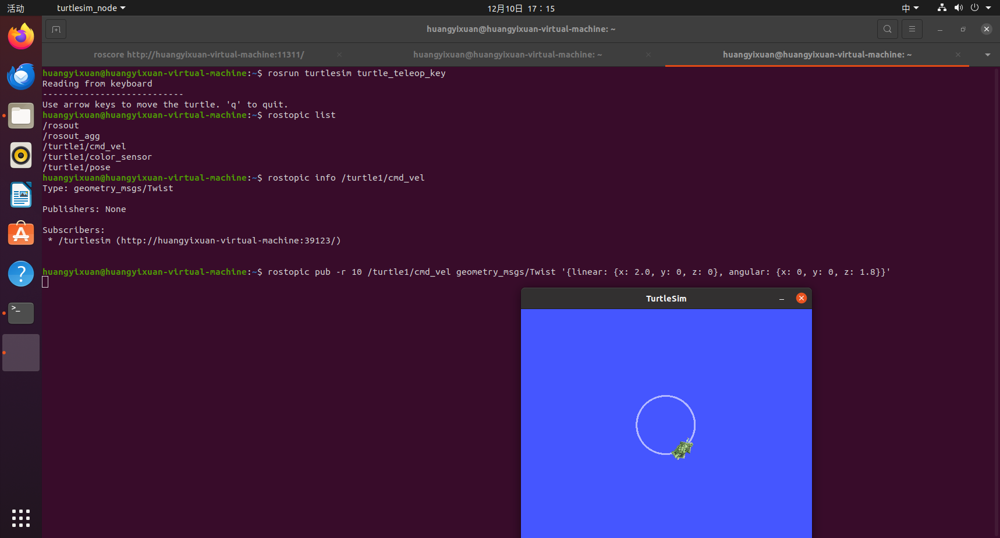
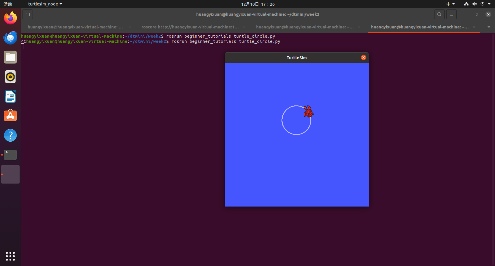

## 7. 多龟 launch + rqt
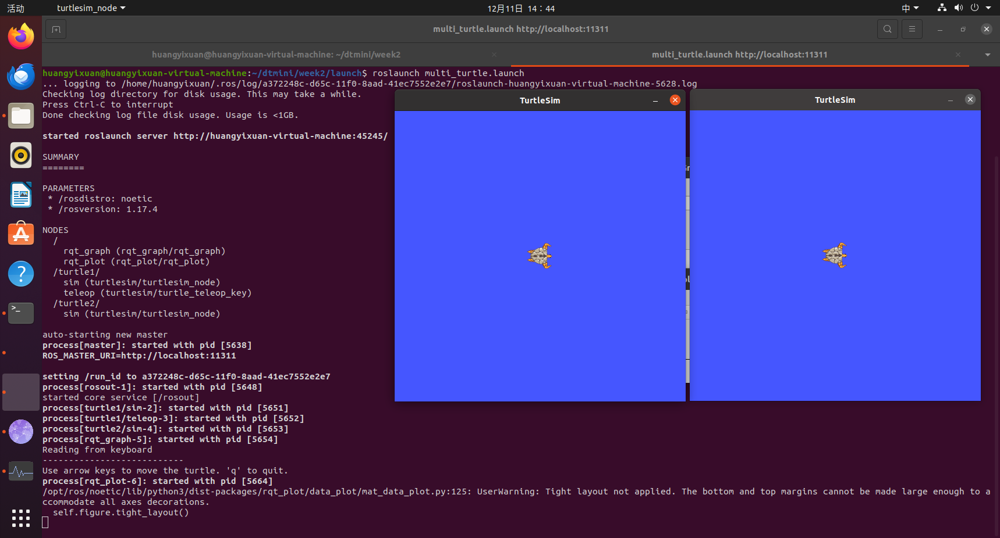
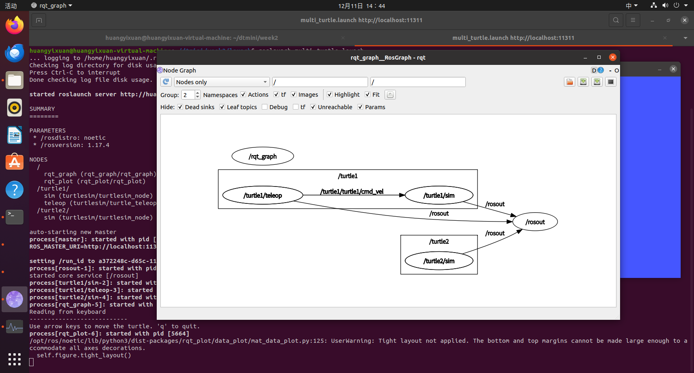
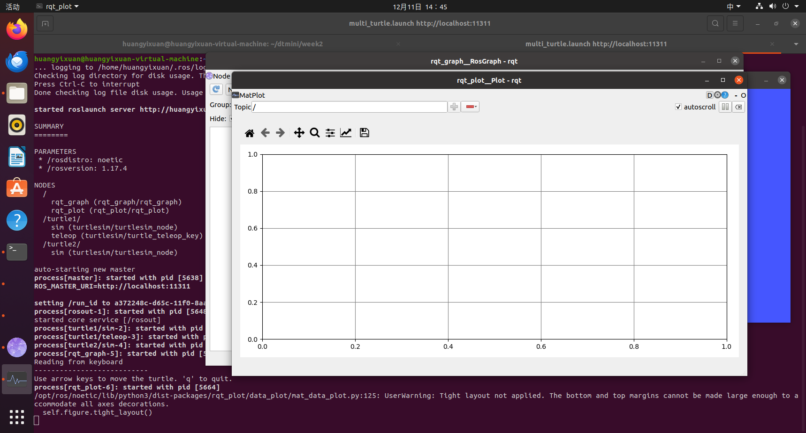
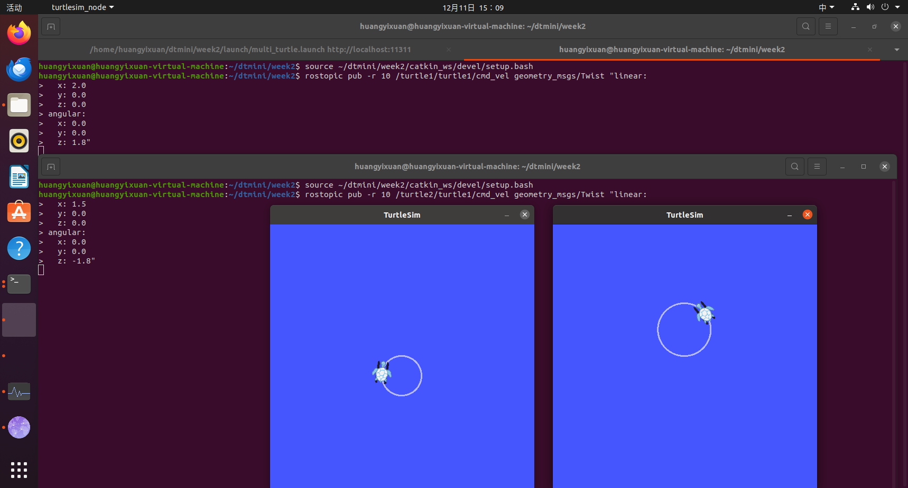

## 8. 源码附录
- [turtle_circle.py](./ros/turtle_circle.py)
- [multi_turtle.launch](./launch/multi_turtle.launch)

## 9. 总结与心得
- ROS 通信机制本质是“话题+节点”，理解后才能灵活 remap。
- launch 文件是批量启动神器，命名空间让多实例一目了然。
- rqt_graph 是调试神器，通信关系一目了然。

> 私有仓库不计绿格，但提交记录完整，符合课程要求。
